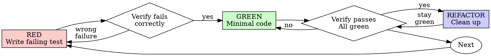

# Test-Driven Development (TDD)

## Overview

Use this skill only after TDD has been selected. TDD is powerful for clear, local behavior, but it is not the mandatory starting point for every task.

If the validation strategy has not been chosen yet, stop and use `choosing-test-strategy` first.

## When To Use

Use TDD when:
- The expected behavior is already clear
- A failing test can drive the interface
- The logic is local enough that a focused test gives real signal
- A bug fix needs a tight automated guardrail and TDD is the chosen approach

Do not use TDD when:
- The work is exploratory and the interface is still moving
- The main risk is visual or UX quality
- Integration behavior matters more than local logic
- Another validation strategy was chosen for this task

## The Iron Law

```text
NO PRODUCTION CODE WITHOUT A FAILING TEST FIRST
```

Once TDD is chosen, follow it strictly.

Write code before the test? Delete it. Start over.

## Red-Green-Refactor



## Process

### RED

Write one focused failing test for the next piece of behavior.

Requirements:
- One behavior
- Clear test name
- Real signal, not fake mock coverage

### VERIFY RED

Run the test and confirm:
- It fails
- It fails for the expected reason
- It proves the behavior is missing or broken

### GREEN

Write the smallest production change that makes the test pass.

Do not:
- Add unrelated features
- Refactor for fun
- Expand scope while the test is still red

### VERIFY GREEN

Run the relevant tests and confirm the output is clean.

### REFACTOR

Improve names, structure, and duplication while keeping tests green.

## Guardrails

- TDD is strict only after it has been chosen.
- Do not use TDD to force certainty onto an exploratory task.
- Do not claim to be doing TDD if the tests came after the code.
- If the tests are fighting the design, question whether TDD was the right strategy for this task.

## Common Rationalizations

| Excuse | Reality |
|--------|---------|
| "I can decide the testing strategy later" | If TDD was not chosen yet, choose first. |
| "This task is visual, but I should still force TDD" | Wrong strategy. Pick a better validation method. |
| "I'll write tests after the code" | That is not TDD. |
| "I already wrote the implementation, I can adapt it" | Delete it and restart if you are doing TDD. |
| "Manual verification should count as TDD" | Manual checks are a different strategy. |

## Completion Checks

- [ ] TDD was explicitly chosen before implementation
- [ ] Each targeted test failed before the code was written
- [ ] Minimal code was written to make the test pass
- [ ] Relevant tests pass cleanly
- [ ] Any refactor happened only after green

## Related Skills

- `choosing-test-strategy` decides whether TDD is appropriate
- `verification-before-completion` verifies the chosen evidence before claiming success
