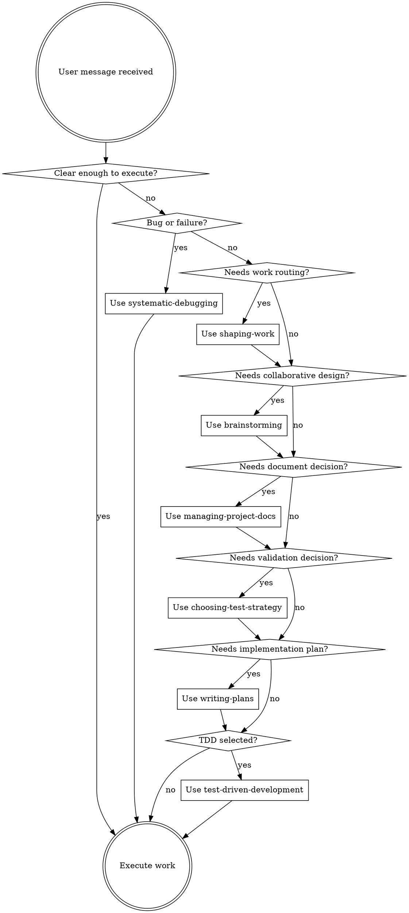

<SUBAGENT-STOP>
If you were dispatched as a subagent to execute a specific task, skip this skill.
</SUBAGENT-STOP>

## Overview

Use the lightest skill flow that matches the work. The point of RedTeaPowers is better decisions and cleaner execution, not ceremony for its own sake.

User instructions always win. If the user asks for a lighter or different process, follow that unless it would create obvious risk.

If the request is already clear, low-risk, and ready to execute after a quick context check, stop routing and do the work.
Use a small convergence budget by default: only enough clarification, documentation, and planning to change the route or protect against real risk.

## Core Rule

Check whether a skill materially helps before acting. If one clearly applies, use it. If multiple apply, route through the process skill that decides the shape of the work before loading heavier implementation workflows.

Do not force heavy process just because a skill exists.
Do not keep routing once the next practical step is obvious.
Do not exceed one round of low-value clarification or one active new document unless the work clearly justifies it.

## Routing Order

Choose process skills in this order:

1. `systematic-debugging` for bugs, failures, and unexpected behavior
2. `shaping-work` for new work, mixed requests, batching decisions, or "do we need spec/plan?" questions when the right level of structure is still unclear
3. `brainstorming` only when the work actually needs collaborative design and decision-making
4. `managing-project-docs` when deciding which document type to create or update
5. `migrating-project-docs` when legacy project documents need conversion into the RedTeaPowers taxonomy
6. `choosing-test-strategy` when validation is not already obvious or before writing a plan that depends on the validation mode
7. `writing-plans` only when the chosen route needs a formal plan or a multi-step execution artifact beyond a simple todolist
8. `test-driven-development` only when TDD was explicitly chosen or clearly requested

## Decision Flow

## Red Flags

These thoughts mean stop and route more carefully:

| Thought | Reality |
|---------|---------|
| "Every change needs brainstorming" | Many changes only need shaping and direct execution. |
| "Every multi-step task needs a full plan" | Some tasks only need a checklist or todolist. |
| "Every change needs a spec" | Specs are for alignment, not for routine paperwork. |
| "Every implementation needs TDD" | TDD is one strategy, not the universal default. |
| "The smallest closed loop is always best" | After uncertainty drops, batch related work and move faster. |
| "We should keep asking or writing first" | Stop once more convergence would not change the route. |
| "Let's fix each similar small issue one by one" | When 3 or more same-kind low-risk items are visible, batch them by default. |
| "We opened the topic with one slice, so let's keep slicing" | A first slice should open the lane, not trap the work in micro-loops. |
| "We should keep routing just to be safe" | Once the route is clear, execution is usually safer than more ceremony. |
| "This skill is overkill, skip all skills" | Use the right skill, not necessarily the heaviest one. |

## Platform Adaptation

Skills use Claude Code tool names. Non-CC platforms: see `references/copilot-tools.md` (Copilot CLI) and `references/codex-tools.md` (Codex) for tool equivalents.

## Reference

- Read [workflow-overview.md](references/workflow-overview.md) for the modernized routing, validation, and documentation model.
- Read [library-status-matrix.md](references/library-status-matrix.md) for the current keep, rewrite, and archive decisions across the library.
- Read [migrating-from-superpowers.md](references/migrating-from-superpowers.md) when converting older superpowers-based workflows, docs, or prompts into RedTeaPowers.
